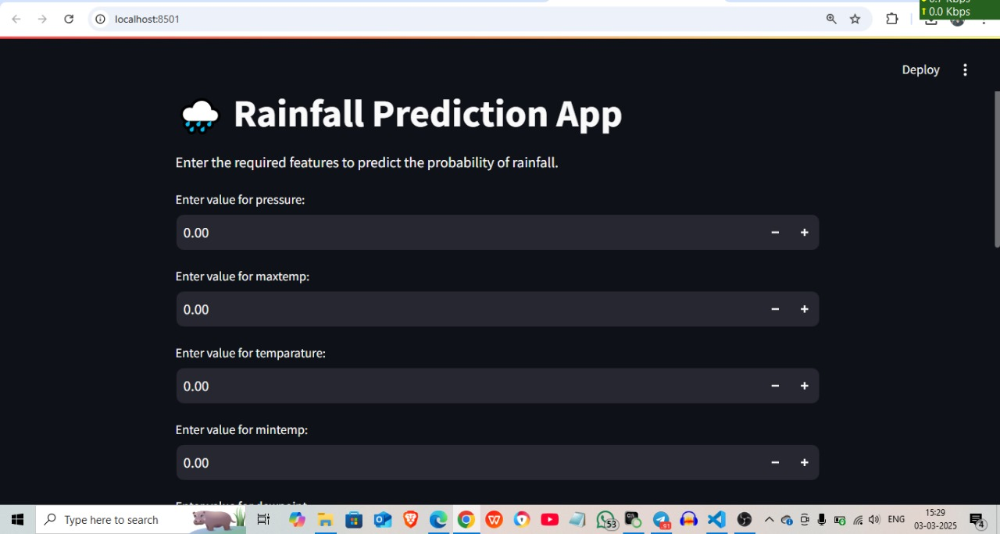

# Rainfall Prediction App

This repository contains a Streamlit-based web application for predicting rainfall probability using a trained deep learning model.

## 📌 Requirements

Ensure you have the following installed:

- Python latest version
- TensorFlow
- Streamlit
- Pandas
- NumPy
- Scikit-learn

## 📥 Installation

1. **Clone the Repository**: 
2. run in command prompt

```bash
git clone https://github.com/yourusername/rainfall_prediction_app.git
cd rainfall_prediction_app
```

2. **Create a Virtual Environment (Recommended)**

```bash
python -m venv venv
source venv/bin/activate  # On macOS/Linux
venv\Scripts\activate     # On Windows
```

3. **Install Dependencies in current directory**

```bash
pip install -r requirements.txt
```

## 📂 Dataset Preparation

Ensure you have the dataset file `train.csv` in the `Dataset/` directory.
If needed, download it and place it in the correct path:

```bash
mkdir Dataset
mv /path/to/your/train.csv Dataset/
```

## 🚀 Running the Streamlit App

1. **Load the trained model**
   Ensure that `rainfall_prediction_model.h5` is in the project directory.

2. **Run the Streamlit App**

```bash
streamlit run app.py
```

## 🛠 Troubleshooting

- **If the model does not load:** Ensure that `rainfall_prediction_model.h5` is not corrupted and is compatible with your TensorFlow version.
- **If dependencies fail:** Try upgrading or reinstalling using:

```bash
pip install --upgrade tensorflow keras
```

## 📜 License

This project is licensed under the MIT License.

---

**Happy Coding! 🚀**

